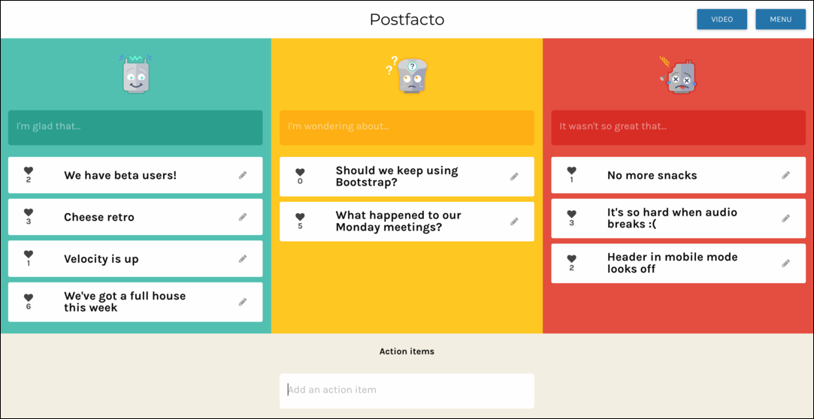

# postfacto

Postfacto is a **free**, **open-source** and **self-hosted** **retro tool** aimed at helping **remote teams**.



Postfacto was created by [Pivotal Labs](https://pivotal.io/labs) by a team in their [Sydney office](https://pivotal.io/locations/sydney). It was originally available as a hosted SAAS product at [postfacto.io](https://postfacto.io) but has since been open sourced and focused on being a self hosted product. Postfacto is made up of a **React** web app and a **Ruby on Rails** API that provides an API for the front end.

You can stay up to date with the latest Postfacto releases by signing up to our [mailing list](http://eepurl.com/dlQPND).

## Features

### Run retros remotely

Postfacto let's you run an agile retrospective even when your team is distributed across the world.

### Record action items

Retros are designed to help the team improve and that's hard to do without keeping track of the actions the team needs to carry out and the also the one's you've achieved. Postfacto tracks the items you enter week to week to help you keep on top of them.

### Choose your level of security

You can create private retro boards for your team that are password protected or choose to leave them public so that anyone you give the link to can access it. You can also let users sign up to your instance using Google OAuth or control access with the admin dashboard.

### Use your own video conferencing

Postfacto will auto generate you an [appear.in](https://appear.in) room for your team to chat in during the retro but you can also choose to link to your own conferencing tools.

### Easily deployable

You can [deploy](#deployment) your own Postfacto to **Pivotal Web Services** or **Pivotal Cloud Foundry** and stay in control of your own data.

## Development

### Dependencies

* Ruby 2.4.0
* bundler
* rspec
* Node 6
* npm 3.10.10 (`npm install -g npm@3.10.10`)
* gulp
* chromedriver

You can use the Postfacto [docker image](https://hub.docker.com/r/postfacto/postfacto/) for development.

### Installing library dependencies

You can install library dependencies (gems and npm packages) for the `web`, `api` and `e2e` codebases by running:

```bash
./deps.sh
```

### Running locally

You can run Postfacto locally at [http://localhost:3000]() by running:

```bash
./run.sh
```

The admin dashboard will be available at [http://localhost:4000/admin](). You can create an admin user using the following rake task in the `api` directory:

```bash
ADMIN_EMAIL=email@example.com ADMIN_PASSWORD=password rake admin:create_user
```

### Running tests

You can run the tests for the whole project in the root directory by simply running:

```bash
./test.sh
```

#### Web

```bash
cd web
gulp spec-app
```

#### API

```bash
cd api
bundle exec rake
```

#### End to end

```bash
cd web
gulp local-acceptance
```

## Deployment

Download the [latest release](https://github.com/pivotal/postfacto/releases) and follow the included instructions on deploying your own instance of Postfacto.

## Contributing

See our [Contributing Guide](CONTRIBUTING.md).

## License

Postfacto is licensed under the **GNU Affero General Public License** (often referred to as **AGPL-3.0**). The full text of the license is available [here](LICENSE.md). It's important to note that this license allows you to deploy an instance of Postfacto for private, public or internal use.
